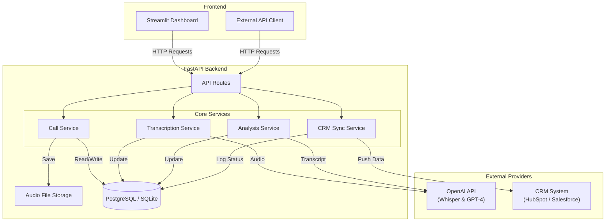
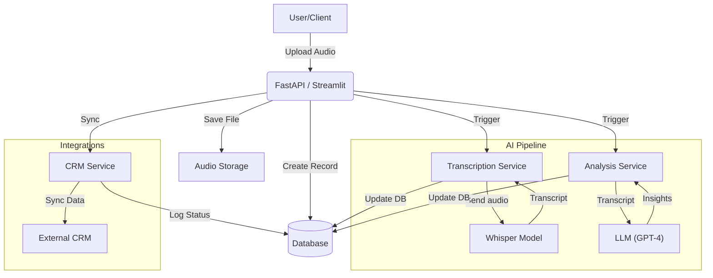

# Prema Sales Call Summarizer

**AI-powered sales intelligence that captures, analyzes, and syncs call data to your CRM automatically.**

> Built by **Prema Vision LLC**, an AI automation consultancy led by **Denys Korolkov**.

## ⭐ Live Demo

- **Web UI:** [https://prema-sales-call-summarizer.streamlit.app](https://prema-sales-call-summarizer.streamlit.app)
- **API Docs (Swagger):** [https://prema-sales-call-summarizer.onrender.com/docs](https://prema-sales-call-summarizer.onrender.com/docs)
*(Note: API docs availability depends on deployment configuration)*

## ⭐ Walkthrough

[User Happy Path](https://share.cleanshot.com/8KDfSKGM+)

## ⭐ Screenshots


---

## Elevator Pitch

Sales teams lose 60% of critical customer context the moment a call ends. **Prema Sales Call Summarizer** is an automated intelligence layer that ingests audio, extracts high-value business insights, and syncs structured data directly to your CRM. It eliminates manual data entry and ensures risk factors and action items are captured accurately. This solution bridges the gap between conversation and system of record.

## Why This Project Matters

This project demonstrates how AI can operationalize sales intelligence without requiring changes to the team's existing workflow. For high-velocity sales and customer success teams, data integrity is the bottleneck to scaling.

- **Sales Ops:** Eliminates "shadow CRM" where data lives in reps' heads.
- **RevOps:** Provides structured data for objection handling and product feedback loops.
- **Management:** Offers auditable, AI-generated summaries for coaching and deal reviews.

## Core Features

- **Multi-Format Audio Ingestion:** Supports MP3, WAV, M4A via secure upload.
- **Enterprise-Grade Transcription:** Utilizes OpenAI Whisper for near-human accuracy.
- **Context-Aware AI Analysis:** Extracts executive summaries, key pain points, and objection handling patterns.
- **Automated Follow-up:** Generates draft emails based on call context.
- **CRM Sync Layer:** Pushes structured data to CRM (stubbed for demo, architecture-ready for HubSpot/Salesforce).
- **Dual Interface:** Robust REST API for integrations + dedicated Streamlit dashboard for manual usage.

## Architecture Overview

The system follows a modular service-oriented architecture designed for scalability and maintainability. The architecture separates ingestion, transcription, analysis, and CRM sync into modular services, enabling easy scaling and replacement of components.



## Data Flow



## Tech Stack

- **Backend:** Python 3.11, FastAPI, Pydantic
- **Data Layer:** SQLModel (SQLAlchemy), SQLite (Dev), PostgreSQL (Prod)
- **Frontend:** Streamlit
- **AI Services:** OpenAI Whisper (ASR), GPT-4o-mini (LLM)
- **Testing:** Pytest, Playwright (E2E)
- **Deployment:** Render (Docker/Python runtime)

## Setup & Running

### Prerequisites

- Python 3.11+
- OpenAI API Key (optional for stub mode)

### Installation

```bash
# Clone the repository
git clone <repo-url>
cd prema-sales-call-summarizer

# Create virtual environment
python3.11 -m venv .venv
source .venv/bin/activate  # Windows: .venv\Scripts\activate

# Install dependencies
pip install --upgrade pip setuptools wheel
pip install -r requirements.txt

# Environment Setup
cp .env.example .env
# Edit .env to add your OPENAI_API_KEY
```

### Running the Application

**Option 1: Dedicated Dashboard (UI)**
```bash
streamlit run app/ui/streamlit/dashboard.py
```
*Access at http://localhost:8501*

**Option 2: REST API (Backend)**
```bash
uvicorn app.main:app --reload
```
*Docs at http://localhost:8000/docs*

## How to Use (Step-by-Step)

1.  **Upload:** Navigate to the "Upload New Call" sidebar. Enter call metadata and upload an audio file.
2.  **Transcribe:** Click the **🎙️ Transcribe** button on the call card. The system processes the audio and generates a verbatim transcript.
3.  **Analyze:** Click **🧠 Analyze**. The LLM extracts insights, pain points, and drafts a follow-up email.
4.  **Review & Edit:** Edit the generated email draft if needed. Select specific "Action Items" to track.
5.  **Sync:** Click **🔄 Sync CRM**. Data is pushed to the CRM system (simulated in this demo) and the status updates to `SYNCED`.

## API Examples

**Create a Call**
```bash
curl -X POST "http://localhost:8000/api/v1/calls/" \
  -F "title=Discovery with Acme" \
  -F "audio_file=@recording.mp3"
```

**Trigger Analysis**
```bash
curl -X POST "http://localhost:8000/api/v1/calls/{call_id}/analyze"
```

## Who This Is For

- **CTOs & Engineering Leads:** Looking for a reference architecture for AI-driven workflow automation.
- **Founders:** Evaluating the feasibility of custom sales AI tools.
- **Sales Operations:** Seeking to automate CRM data entry and improve data quality.

## Extensibility & Future Enhancements

- **Real-time Processing:** Streaming transcription for live call assistance.
- **Vector embeddings (optional integration-ready):** Querying past calls for competitive intelligence.
- **Native Integrations:** Direct OAuth connections to HubSpot, Salesforce, and Pipedrive.
- **Multi-Tenant Support:** Architecture supports schema isolation for SaaS deployment.

## Contact

**Denys Korolkov** — Prema Vision LLC

📧 [denys@premavision.net](mailto:denys@premavision.net)

🌐 [https://premavision.net](https://premavision.net)
